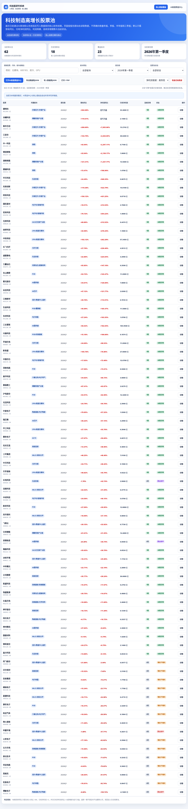
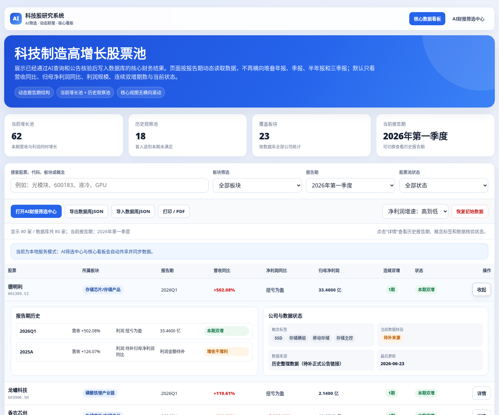
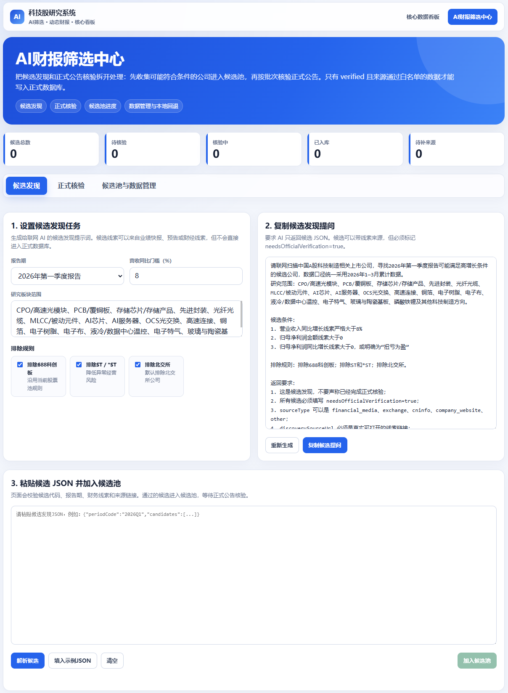
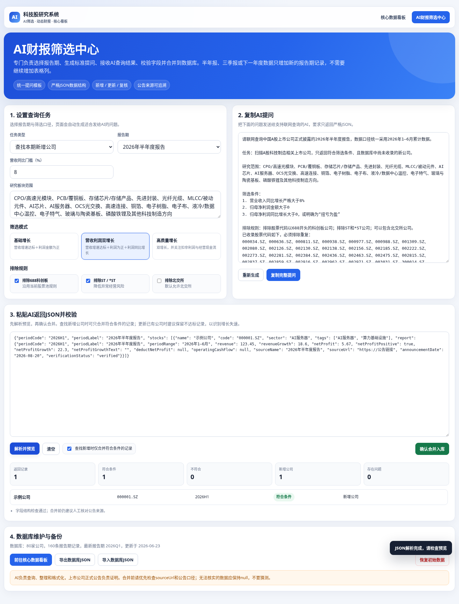
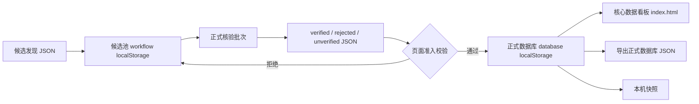

# 科技制造高增长股票 AI 研究系统

一个面向科技制造方向的本地化股票研究工具。项目以“正式公告数据”为核心，结合 AI 辅助候选发现、正式公告核验、候选池管理、数据备份和 PDF 字段级校验，帮助用户持续维护一份可追溯、可筛选、可导出的高增长股票数据库。

> 免责声明：本项目仅用于财务数据整理、行业研究和个人学习，不构成任何投资建议。股票筛选结果不代表买卖建议，使用者应自行核验公告原文并独立判断风险。

## 目录

- [界面预览](#界面预览)
- [系统特色](#系统特色)
- [当前数据状态](#当前数据状态)
- [项目结构](#项目结构)
- [快速开始](#快速开始)
- [操作流程](#操作流程)
- [使用说明和注意事项](#使用说明和注意事项)
- [程序维护](#程序维护)
- [数据结构说明](#数据结构说明)
- [常见问题](#常见问题)
- [后续扩展方向](#后续扩展方向)

## 界面预览

### 核心数据看板

`index.html` 用于查看正式数据库中的公司、报告期、增长指标、来源信息和 PDF 字段级核验状态。



### 公司详情与历史报告

看板支持展开公司详情，查看历史报告、公告来源、核验状态、字段级校验结果和备注信息。



### AI 筛选中心

`screening.html` 是数据入口和维护中心，包含“候选发现 / 正式核验 / 候选池与数据管理”三段工作流。



### JSON 解析与正式核验

页面支持解析 AI 返回的 JSON，自动清洗常见 Markdown 代码块、前后说明文字和包装格式，并在入库前做严格校验。



## 系统特色

### 1. 纯前端、本地运行

项目由 HTML、CSS 和 JavaScript 构成，无需后端服务、数据库服务器或登录账号。正式数据库、候选池和本机快照默认保存在浏览器 `localStorage` 中。

适合场景：

- 个人研究和本地维护；
- 离线查看已保存数据；
- 把正式数据库导出为 JSON 后跨设备备份；
- 结合 AI 工具进行候选发现和公告核验。

### 2. 两步 AI 协作流程

系统不直接相信 AI 给出的结论，而是把 AI 使用拆成两步：

1. **候选发现**：AI 可以基于公开线索、新闻、公告摘要等发现可能符合条件的公司，但这些公司只会进入候选池。
2. **正式核验**：AI 必须回到巨潮资讯、交易所公告或其他正式来源，逐项填写正式公告字段。只有通过页面校验的 `verifiedStocks` 才能写入正式数据库。

这种设计可以降低“AI 直接编造数据入库”的风险。

### 3. 正式数据库准入门

正式数据写入前会经过统一校验，包括但不限于：

- 股票代码格式必须合法，例如 `000001.SZ`、`600000.SH`；
- 报告期必须与当前核验任务一致；
- `verificationStatus` 必须为 `verified`；
- 营业收入同比、归母净利润、归母净利润同比等关键字段必须可校验；
- 页面会重新计算财务筛选条件，不直接相信 AI 的筛选结论；
- 来源域名必须来自正式公告白名单或明确人工确认的来源；
- 同一批次不能出现重复股票代码；
- 候选公司必须属于本次提交名单，避免 AI 夹带额外公司。

### 4. 正式来源白名单

系统会识别公告链接来源，并阻止财经媒体、搜索页、占位链接或未知域名直接作为正式核验依据。

当前自动认可的正式来源包括：

- 巨潮资讯：`cninfo.com.cn`
- 上海证券交易所：`sse.com.cn`
- 深圳证券交易所：`szse.cn`
- 北京证券交易所：`bse.cn`

### 5. 候选池与正式数据库隔离

候选池保存在独立的工作流数据库中，不会污染正式数据库。候选可以处于：

- 待核验；
- 核验中；
- 已入库；
- 已淘汰；
- 无法核验。

正式数据库只接收通过正式核验的数据。

### 6. 集中数据管理

所有正式数据库维护操作集中在 `screening.html` 的“候选池与数据管理”标签中，包括：

- 正式数据库导出；
- 正式数据库导入；
- 同步最新版内置数据；
- 恢复初始数据；
- 候选池工作流导入 / 导出；
- 本机快照创建、恢复、删除；
- 正式数据维护；
- 删除指定报告期；
- 删除整家公司；
- 查看待补公告来源清单；
- 查看来源健康度概览。

`index.html` 只负责查看、筛选、分析和打印，不再承担导入、导出、同步或重置操作。

### 7. 本机快照和删除前保护

重要操作前后会自动创建本机回退快照，最多保留最近 20 个。支持恢复和删除快照。

会自动创建快照的场景包括：

- 导入正式数据库；
- 同步内置数据；
- 正式核验入库；
- 恢复初始数据；
- 恢复本机快照；
- 删除报告期；
- 删除整家公司。

注意：本机快照只保存在当前浏览器中，不能代替正式 JSON 文件备份。

### 8. PDF 字段级核验

项目提供 `tools/audit-pdf-fields.js`，用于下载并解析正式公告 PDF，抽取营业收入、归母净利润、同比增速等字段，和数据库字段进行比对。

字段级核验结果会写入：

- `fieldVerificationStatus`
- `fieldVerificationNote`
- `fieldVerifiedAt`
- `fieldVerification`

汇总结果保存在：

```text
data/pdf-field-audit-result.json
```

当前内置数据库已完成 PDF 字段级核验标记。

## 当前数据状态

当前内置正式数据库状态：

| 项目 | 状态 |
| --- | --- |
| 数据结构版本 | `2.1.0` |
| 内置数据版本 | `2026-06-24-pdf-field-audited-v1` |
| 公司数量 | 80 家 |
| 报告记录 | 160 条 |
| 报告期 | `2025A`、`2026Q1` |
| 已核验记录 | 160 条 |
| 默认存储位置 | 浏览器 `localStorage` |

默认筛选条件：

- 营业收入同比严格大于 8%；
- 归母净利润金额严格大于 0；
- 归母净利润同比严格大于 0，或公告明确为“扭亏为盈”；
- 默认排除科创板 `688` 开头公司；
- 默认排除 ST / `*ST`；
- 默认排除北交所公司。

## 项目结构

```text
tech-stock-ai-research-system/
├─ index.html                         # 核心数据看板
├─ screening.html                     # AI 筛选中心与数据管理入口
├─ start-server.bat                   # Windows 本地静态服务器启动脚本
├─ run-tests.bat                      # Windows 测试脚本
├─ package.json                       # Node 依赖与测试命令
├─ README.md                          # 项目说明文档
├─ CHANGELOG.md                       # 更新日志
├─ SHA256SUMS.txt                     # 文件校验清单
├─ assets/
│  ├─ css/
│  │  ├─ common.css                   # 全局通用样式
│  │  ├─ dashboard.css                # 核心看板样式
│  │  └─ screening.css                # 筛选中心样式
│  └─ js/
│     ├─ default-data.js              # 内置数据库
│     ├─ database.js                  # 正式数据库读写、校验、迁移、备份
│     ├─ dashboard.js                 # 核心看板逻辑
│     ├─ research-workflow.js         # AI 工作流、候选池和 JSON 解析
│     └─ screening.js                 # 筛选中心页面逻辑
├─ data/
│  ├─ stocks.json                     # 正式数据库 JSON 文件
│  ├─ ai-response-example.json        # 旧版 AI 响应示例
│  ├─ candidate-discovery-example.json
│  ├─ official-verification-example.json
│  ├─ cninfo-source-verification-result.json
│  ├─ pdf-field-audit-result.json
│  └─ 2025A-net-profit-supplement-audit.csv
├─ docs/
│  ├─ DATA-SCHEMA.md                  # 数据结构说明
│  ├─ PHASE1-TECHNICAL-NOTES.md       # 工作流技术说明
│  ├─ 2025A-NET-PROFIT-SUPPLEMENT.md
│  └─ preview-*.png                   # README 预览图
├─ tools/
│  ├─ audit-pdf-fields.js             # PDF 字段级核验工具
│  └─ fill-cninfo-sources.js          # 来源补齐辅助工具
└─ tests/
   └─ stage1-tests.js                 # 数据层与工作流测试
```

## 快速开始

### 方式一：双击启动

Windows 用户可以直接双击：

```text
start-server.bat
```

脚本会在当前目录启动静态服务器，并打开：

```text
http://127.0.0.1:8000/
```

推荐使用 `127.0.0.1:8000`，而不是直接双击 HTML 文件。这样两个页面可以稳定共享同一个站点下的 `localStorage`。

### 方式二：手动启动

如果已安装 Python，也可以在项目目录运行：

```bash
python -m http.server 8000 --bind 127.0.0.1
```

然后打开：

```text
http://127.0.0.1:8000/
```

### 方式三：直接打开 HTML

可以直接打开 `index.html` 或 `screening.html`，但不推荐长期使用。不同浏览器对 `file://` 页面的本地存储隔离策略不同，可能导致两个页面无法稳定共享数据。

## 操作流程

### 1. 查看正式数据库

打开：

```text
http://127.0.0.1:8000/index.html
```

可以查看：

- 当前增长池；
- 历史观察池；
- 待更新公司；
- 公司详情；
- 历史报告；
- 来源链接；
- 核验状态；
- PDF 字段级核验状态。

### 2. 生成候选发现提示词

打开：

```text
http://127.0.0.1:8000/screening.html
```

进入“候选发现”标签：

1. 选择报告期；
2. 设置营收同比阈值、排除规则和研究范围；
3. 生成候选发现提示词；
4. 复制提示词给支持联网检索的 AI；
5. 要求 AI 返回候选 JSON。

候选发现阶段只负责发现线索，不写入正式数据库。

### 3. 解析候选 JSON

把 AI 返回的候选 JSON 粘贴到页面中，点击解析。页面会：

- 清洗 Markdown 代码块；
- 提取 JSON 对象或数组；
- 校验候选代码格式；
- 校验报告期；
- 校验候选字段；
- 将有效候选写入候选池。

### 4. 生成正式核验批次

进入“正式核验”标签：

1. 选择报告期；
2. 设置每批核验数量；
3. 刷新待核验批次；
4. 将候选标记为核验中；
5. 生成正式核验提示词；
6. 复制给 AI，让 AI 回到正式公告逐家公司核验。

### 5. 合并正式核验结果

AI 应返回以下结构：

```json
{
  "periodCode": "2026Q1",
  "verifiedStocks": [],
  "rejectedStocks": [],
  "unverifiedStocks": []
}
```

页面会分别处理：

- `verifiedStocks`：通过正式来源和页面规则后写入正式数据库；
- `rejectedStocks`：标记为已淘汰；
- `unverifiedStocks`：标记为无法核验。

即使 AI 写了 `verified`，页面仍会重新检查报告期、股票代码、来源域名、财务字段和提交名单完整性。

### 6. 管理候选池和正式数据库

进入“候选池与数据管理”标签，可以完成：

- 候选池状态查看；
- 候选池工作流导入 / 导出；
- 待补公告来源清单查看；
- 来源健康度概览；
- 正式数据库导出 / 导入；
- 同步最新版内置数据；
- 恢复初始数据；
- 本机快照管理；
- 正式数据维护。

### 7. 正式数据维护

“正式数据维护”区域支持：

- 搜索公司、代码或板块；
- 按报告期筛选；
- 仅显示待补 / 异常来源；
- 删除指定公司某一个报告期；
- 删除整家公司；
- 自动创建删除前快照；
- 统计本次维护删除了多少家公司和报告；
- 查看最近删除前快照。

删除操作会二次确认，但删除后仍建议及时导出正式数据库 JSON。

## 使用说明和注意事项

### 本地存储说明

系统主要使用以下 `localStorage` 键：

```text
tech-stock-research-database-v2
tech-stock-research-workflow-v1
tech-stock-research-database-backups-v1
```

含义：

- `tech-stock-research-database-v2`：正式数据库；
- `tech-stock-research-workflow-v1`：候选池、发现批次、核验批次；
- `tech-stock-research-database-backups-v1`：本机回退快照。

清除浏览器站点数据会删除这些内容。

### 备份、命名和恢复

系统里有两类“备份”，用途不同：

| 类型 | 位置 | 用途 | 是否适合长期保存 |
| --- | --- | --- | --- |
| 正式数据库 JSON 备份 | 下载到电脑文件夹 | 跨浏览器、跨电脑、长期归档、重新导入 | 适合 |
| 本机快照 | 当前浏览器 `localStorage` | 短期误操作回退 | 不适合 |

#### 导出正式数据库备份

正式数据库备份是最重要的备份文件。建议每次完成正式核验、删除数据、同步内置数据或准备上传 GitHub 前都导出一份。

操作步骤：

1. 启动项目并打开：

   ```text
   http://127.0.0.1:8000/screening.html
   ```

2. 点击顶部标签：

   ```text
   候选池与数据管理
   ```

3. 找到：

   ```text
   正式数据库管理
   ```

4. 点击按钮：

   ```text
   导出正式数据库
   ```

5. 浏览器会下载一个 `.json` 文件，这个文件就是正式数据库备份。

#### 备份文件放在哪里

建议在项目目录外单独建立一个备份文件夹，不要只放在浏览器默认“下载”目录里。

推荐位置示例：

```text
D:\StockResearchBackups\
```

或者：

```text
C:\Users\你的用户名\Documents\StockResearchBackups\
```

如果想和项目放在一起，也可以建立：

```text
tech-stock-ai-research-system\backups\
```

但如果准备上传到 GitHub，请注意：`backups/` 里的文件可能包含你自己的研究数据。公开仓库上传前应确认是否适合公开，或者把 `backups/` 加入 `.gitignore`。

#### 备份文件如何命名

推荐使用“日期时间 + 数据类型 + 简短说明”的命名方式，方便按时间排序和回溯。

推荐格式：

```text
YYYYMMDD-HHMM-tech-stock-db-说明.json
```

示例：

```text
20260624-1030-tech-stock-db-before-delete.json
20260624-1105-tech-stock-db-after-verified-merge.json
20260624-1130-tech-stock-db-before-github-release.json
20260624-1200-tech-stock-db-stable.json
```

命名建议：

- `before-delete`：删除公司或报告期前；
- `after-delete`：删除公司或报告期后；
- `before-sync`：同步内置数据前；
- `after-sync`：同步内置数据后；
- `after-verified-merge`：正式核验入库后；
- `before-github-release`：上传 GitHub 或发布版本前；
- `stable`：确认可长期保存的稳定版本。

#### 如何导入备份文件

当需要恢复某个正式数据库 JSON 备份时：

1. 打开：

   ```text
   http://127.0.0.1:8000/screening.html
   ```

2. 进入：

   ```text
   候选池与数据管理
   ```

3. 在“正式数据库管理”区域点击：

   ```text
   导入正式数据库
   ```

4. 选择之前导出的 `.json` 备份文件。

5. 页面导入后会自动刷新正式数据库统计、来源健康度、待补来源清单和正式数据维护列表。

6. 导入成功后，建议马上再点击一次：

   ```text
   导出正式数据库
   ```

   保存一份新的“导入后确认版”备份。

#### 候选池工作流也需要单独备份

正式数据库 JSON 只包含正式入库数据，不等于候选池工作流。

如果你希望保留候选发现记录、核验批次和候选状态，还需要在同一页面中找到“候选池工作流”相关按钮，点击：

```text
导出候选池JSON
```

建议命名：

```text
20260624-1130-tech-stock-workflow-before-github-release.json
```

恢复候选池时，点击：

```text
导入候选池JSON
```

#### 本机快照怎么用

本机快照位于“候选池与数据管理”的“本机快照”区域。它适合处理刚刚发生的误操作，例如：

- 刚删除了错误的报告期；
- 刚删除了整家公司；
- 刚导入了错误文件；
- 刚恢复了错误版本。

可以点击对应快照的：

```text
恢复
```

把当前浏览器中的正式数据库恢复到该快照状态。

注意：

- 本机快照最多保留最近 20 个；
- 本机快照只存在当前浏览器里；
- 清除浏览器站点数据会删除本机快照；
- 换电脑、换浏览器、换域名后，本机快照不会自动跟随；
- 本机快照不能代替正式数据库 JSON 备份。

### 关于 GitHub 上传

建议上传：

- `index.html`
- `screening.html`
- `assets/`
- `data/`
- `docs/`
- `tools/`
- `tests/`
- `package.json`
- `package-lock.json`
- `README.md`
- `CHANGELOG.md`
- `start-server.bat`
- `run-tests.bat`

不建议上传：

- `node_modules/`
- `.cache/`
- 浏览器本地生成的临时文件。

当前 `.gitignore` 已忽略：

```text
node_modules/
.cache/
```

如果不希望上传本机快照目录，也可以把 `backups/` 加入 `.gitignore`。

### 关于 AI 输出

AI 返回内容必须是 JSON。页面可以清洗常见包装格式，但仍建议要求 AI：

- 不要输出 Markdown 表格；
- 不要输出自然语言解释；
- 不要把财经媒体链接当作正式公告；
- 不要把搜索结果页当作正式来源；
- 不要把无法确认的数据填成 `verified`；
- 遇到无法确认的公司放入 `unverifiedStocks`。

### 关于财务单位

正式数据库中金额统一为“亿元”，同比字段为纯数字百分比。例如：

```json
{
  "netProfit": 2.36,
  "revenueGrowth": 27.62
}
```

不要写成：

```json
{
  "netProfit": "2.36亿元",
  "revenueGrowth": "27.62%"
}
```

### 关于“扭亏为盈”

如果公告显示归母净利润同比为“扭亏为盈”，可以使用：

```json
{
  "netProfitGrowth": null,
  "netProfitGrowthText": "扭亏为盈"
}
```

正式核验更新允许 `null` 覆盖旧错误值，避免旧数据残留。

## 程序维护

### 安装依赖

如果需要运行测试或 PDF 字段级核验工具，请先安装 Node 依赖：

```bash
npm install
```

### 运行测试

```bash
npm test
```

或双击：

```text
run-tests.bat
```

测试覆盖内容包括：

- 默认数据加载；
- 旧数据库迁移；
- JSON 清洗；
- 候选发现解析；
- 正式核验解析；
- 正式来源白名单；
- 媒体来源阻断；
- 股票代码校验；
- 财务条件重新计算；
- 候选池去重；
- 正式报告权威替换；
- 导入、同步和备份相关逻辑。

### PDF 字段级核验

运行：

```bash
node tools/audit-pdf-fields.js
```

该脚本会尝试下载正式公告 PDF 并解析字段。运行前请确认网络环境可以访问公告链接。

输出结果：

```text
data/pdf-field-audit-result.json
```

### 来源补齐辅助工具

运行：

```bash
node tools/fill-cninfo-sources.js
```

该脚本用于辅助补齐巨潮资讯来源信息。使用前建议先导出正式数据库作为备份。

### 更新内置数据

内置数据主要位于：

```text
assets/js/default-data.js
data/stocks.json
```

更新建议：

1. 先在页面中导出当前正式数据库；
2. 修改或生成新的 `data/stocks.json`；
3. 同步更新 `assets/js/default-data.js`；
4. 确认 `builtInDataVersion` 已变化；
5. 运行 `npm test`；
6. 打开页面验证数据能自动迁移；
7. 更新 `CHANGELOG.md` 和 `README.md` 中的数据状态。

### 更新 SHA256 校验清单

项目包含 `SHA256SUMS.txt`，用于记录文件哈希。Windows PowerShell 可使用：

```powershell
$files = Get-ChildItem -Recurse -File |
  Where-Object {
    $_.FullName -notmatch '\\.git\\' -and
    $_.FullName -notmatch '\\node_modules\\' -and
    $_.Name -ne 'SHA256SUMS.txt'
  } |
  Sort-Object FullName

$lines = foreach ($file in $files) {
  $rel = Resolve-Path -Relative $file.FullName
  $rel = $rel -replace '^\.\\',''
  $hash = (Get-FileHash -Algorithm SHA256 -LiteralPath $file.FullName).Hash.ToLowerInvariant()
  "$hash  $rel"
}

Set-Content -LiteralPath SHA256SUMS.txt -Value $lines -Encoding ascii
```

### 编码注意事项

项目文件包含中文，建议统一使用 UTF-8。编辑 README、HTML、JS 和 CSS 时，请确认编辑器不会把文件保存为 ANSI、GBK 或其他编码。

## 数据结构说明

详细结构请查看：

```text
docs/DATA-SCHEMA.md
```

核心结构：



正式报告主要字段：

| 字段 | 说明 |
| --- | --- |
| `periodCode` | 报告期代码，例如 `2026Q1` |
| `periodLabel` | 报告期中文名称 |
| `revenue` | 营业收入，单位亿元 |
| `revenueGrowth` | 营业收入同比，数字百分比 |
| `netProfit` | 归母净利润，单位亿元 |
| `netProfitGrowth` | 归母净利润同比，数字百分比 |
| `netProfitGrowthText` | 特殊同比文本，例如“扭亏为盈” |
| `sourceName` | 公告名称 |
| `sourceUrl` | 公告链接 |
| `sourceType` | 来源类型，例如 `cninfo` |
| `sourceHost` | 来源域名 |
| `announcementDate` | 公告日期 |
| `verificationStatus` | `verified`、`pending` 或 `conflict` |

## 常见问题

### 1. 双击 `start-server.bat` 没反应怎么办？

请确认电脑已安装 Python。脚本会依次尝试：

- `python`
- 用户目录下的 Python 安装路径；
- `py`

如果没有 Python，可以安装 Python 后重试，或临时直接打开 HTML 文件。

### 2. 应该访问 `localhost:8000` 还是 `127.0.0.1:8000`？

推荐使用：

```text
http://127.0.0.1:8000/
```

项目脚本默认也会打开这个地址。一般情况下 `localhost:8000` 也可以访问，但为了避免部分系统解析或浏览器存储隔离差异，建议统一使用 `127.0.0.1:8000`。

### 3. 为什么刷新后数据还在？

因为数据保存在浏览器 `localStorage` 中。刷新页面不会清空数据。

### 4. 为什么换浏览器后数据不见了？

`localStorage` 是按浏览器和站点隔离的。Chrome、Edge、Firefox 之间不会自动共享数据。换浏览器前请在“候选池与数据管理”中分别导出：

- 正式数据库 JSON；
- 候选池工作流 JSON。

换到新浏览器后，再进入同一页面点击“导入正式数据库”和“导入候选池JSON”恢复。

### 5. 为什么我导入数据后看起来还是旧数据？

可能是浏览器旧数据优先于内置数据。可以在“候选池与数据管理”中使用：

- 同步最新版内置数据；
- 导入正式数据库；
- 恢复初始数据。

如果仍异常，可以先按“备份、命名和恢复”章节导出正式数据库备份，再清除站点数据后重新打开并重新导入备份文件。

### 6. 为什么 AI 返回了 `verified`，页面仍然拒绝入库？

页面会重新校验，不直接相信 AI。常见原因：

- 股票代码格式错误；
- 报告期不一致；
- 来源不是正式公告域名；
- 链接是媒体文章或搜索页；
- 缺少公告日期；
- 财务字段为空；
- 不满足筛选条件；
- 公司不在当前核验批次中；
- 同一批次出现重复代码。

### 7. 为什么“待补/异常来源”显示 0？

说明当前正式数据库中所有报告记录都满足：

- `verificationStatus` 为 `verified`；
- 来源域名通过正式来源识别；
- 已填写公告日期。

### 8. 删除公司或报告期后能恢复吗？

可以。删除前会自动创建本机快照，可以在“本机快照”区域恢复。但仍建议删除前后导出正式数据库 JSON，因为本机快照只保存在当前浏览器中。

### 9. GitHub Pages 可以直接部署吗？

可以作为静态页面部署，但需要注意：

- GitHub Pages 上的 `localStorage` 和本地 `127.0.0.1` 不是同一份；
- 上传到公开仓库的数据文件会公开；
- 如果正式数据库包含个人维护信息，请先检查是否适合公开。

### 10. 这个项目是否会自动联网抓取股票数据？

页面本身不会自动联网抓取实时股票数据。PDF 字段级核验工具和来源补齐工具可能会访问公告链接，需要手动运行 Node 脚本。

## 后续扩展方向

以下方向适合作为后续版本继续演进：

1. **数据维护操作日志**

   记录每次导入、导出、同步、恢复、删除的时间、动作、影响公司和报告数量，方便追溯。

2. **更细粒度的来源健康度筛选**

   将“待补/异常来源”拆成来源缺失、未核验、冲突、非白名单、缺少公告日期等独立筛选。

3. **PDF 核验结果可视化**

   在页面中展示字段差异明细，例如公告原文值、数据库值、差异类型和建议处理方式。

4. **批量维护工具**

   支持批量删除某报告期、批量标记关注状态、批量导出筛选结果。

5. **更多报告期支持**

   扩展到 `2026H1`、`2026Q3`、`2026A` 以及后续年度报告。

6. **自定义行业模板**

   为半导体、AI 服务器、工业软件、机器人、低空经济等方向建立不同的候选发现提示词模板。

7. **可选后端同步**

   增加本地文件或轻量数据库后端，实现多浏览器、多设备共享。

8. **权限和多人协作**

   如果未来团队使用，可以增加操作人、审核人、变更记录和审批状态。

9. **自动化公告索引**

   对接交易所公告检索或本地公告索引，减少人工查找公告链接的工作量。

10. **风险提示维度**

    增加商誉、现金流、毛利率、应收账款、存货、客户集中度等风险指标。

## 版本说明

当前项目版本：

```text
v1.0.0
```

主要能力：

- 核心数据看板；
- 两步 AI 工作流；
- 候选池管理；
- 正式核验入库；
- 来源白名单；
- 本机快照；
- 正式数据维护；
- 来源健康度概览；
- PDF 字段级核验；
- JSON 导入导出。

更多更新记录请查看：

```text
CHANGELOG.md
```
